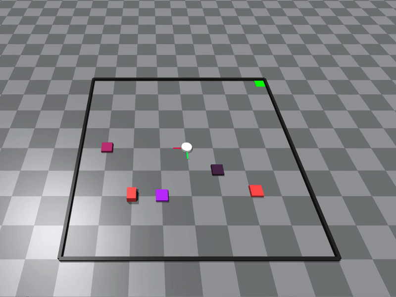
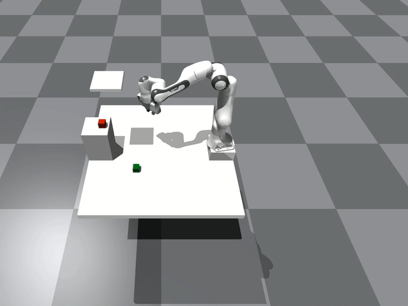

<p align="center">
    <h1 align="center">Multi-Modal MPPI and Active Inference for Reactive Task and Motion Planning</h1>
    <h3 align="center"><a href="https://ieeexplore.ieee.org/document/10592649">Paper</a> | <a href="https://autonomousrobots.nl/paper_websites/m3p2i-aip">Website</a> | <a href="https://www.youtube.com/watch?v=y2CTgv6hxVI&t=2s">Video</a> </h3>
</p>

Repository for reactive task and motion planning making use of active inference for symbolic planning, and a new multi-modal MPPI for motion planning. Rollouts are evaluated in IsaacGym, a parallelizable physics simulator.

<p align="center">
     &nbsp; 
</p>


## Installation
First, clone the repo in your folder and create the conda environment. 
````bash
cd <project_folder>
git clone https://github.com/tud-amr/m3p2i-aip.git

conda create -n m3p2i-aip python=3.8
conda activate m3p2i-aip
````

This project requires the source code of IsaacGym. Check for the [prerequisites and troubleshooting](https://github.com/tud-amr/m3p2i-aip/blob/master/thirdparty/README.md). Download it from https://developer.nvidia.com/isaac-gym, unzip and paste it in the `thirdparty` folder. Move to IsaacGym and install the package.
````bash
cd <project_folder>/m3p2i-aip/thirdparty/IsaacGym_Preview_4_Package/isaacgym/python
pip install -e. 
````

Then install the current package by:
````bash
cd <project_folder>/m3p2i-aip
pip install -e. 
````

Now you are ready to test an example file, where you can drive the robot around with ASDW keys.

````bash
cd <project_folder>/m3p2i-aip/examples
python3 example_key.py
````

## Run the scripts

If you want to test the TAMP framework, you will need two instances of Isaac Gym, one for throwing the rollouts and deriving the optimal solution, and one for updating the "real system". Please run the commands below in two terminals from the `scripts` folder with activated python environment.

Run this terminal first:
````bash
cd <project_folder>/m3p2i-aip/scripts
conda activate m3p2i-aip
python3 reactive_tamp.py --robot $(robot_type) --task $(task_type)
````

Then run the second terminal:
````bash
cd <project_folder>/m3p2i-aip/scripts
conda activate m3p2i-aip
python3 sim.py --robot $(robot_type) --task $(task_type)
````

Specifically, you can test the following:

### Push only using MPPI
````bash
python3 reactive_tamp.py --robot point --task push
````

````bash
python3 sim.py --robot point --task push
````
>[!NOTE]
Pushing will always fail if the **initial position** is in the corner.

### Pull only using MPPI
````bash
python3 reactive_tamp.py --robot point --task pull
````

````bash
python3 sim.py --robot point --task pull
````
>[!NOTE]
Pulling will always fail if the **goal** is in the corner.

### Multi-modal push pull using M3P2I
````bash
python3 reactive_tamp.py --robot point --task hybrid --multimodal True
````

````bash
python3 sim.py --robot point --task hybrid --multimodal True
````

### Reactive pick using MPPI
You can play with the cube using ASDW keys.
````bash 
python3 reactive_tamp.py --robot panda --task reactive_pick
````

````bash 
python3 sim.py --robot panda --task reactive_pick
````

### Multi-modal pick using M3P2I
You can play with the cube using ASDW keys.
````bash 
python3 reactive_tamp.py --robot panda --task reactive_pick --multimodal True
````

````bash 
python3 sim.py --robot panda --task reactive_pick --multimodal True
````

## Cite

If you find the code useful, please cite:
```
@article{zhang2024multi,
  title={Multi-Modal MPPI and Active Inference for Reactive Task and Motion Planning},
  author={Zhang, Yuezhe and Pezzato, Corrado and Trevisan, Elia and Salmi, Chadi and Corbato, Carlos Hern{\'a}ndez and Alonso-Mora, Javier},
  journal={IEEE Robotics and Automation Letters},
  year={2024},
  publisher={IEEE}
}
```

## Related works

* **Isaac-mppi**: an MPPI implementation that uses IsaacGym as a dynamic model ([paper](https://arxiv.org/abs/2307.09105), [website](https://sites.google.com/view/mppi-isaac/), [code](https://github.com/tud-airlab/mppi-isaac)).
* **Biased-mppi**: an MPPI implementation whose sampling distribution is informed with ancillary controllers ([paper](https://ieeexplore.ieee.org/document/10520879), [website](https://autonomousrobots.nl/paper_websites/biased-mppi), [code](https://github.com/eliatrevisan/biased-mppi)).
* **AIP**: an Active Inference planner for decision making ([paper](https://ieeexplore.ieee.org/document/10004745), [video](https://www.youtube.com/watch?v=dEjXu-sD1SI), [code](https://github.com/cpezzato/decision_making)).

## Acknowledgment

We thank the pioneers (Grady Williams, [pytorch_mppi](https://github.com/UM-ARM-Lab/pytorch_mppi), [storm](https://github.com/NVlabs/storm)) who have paved the way and the future newcomers who will propel MPPI forward! 
