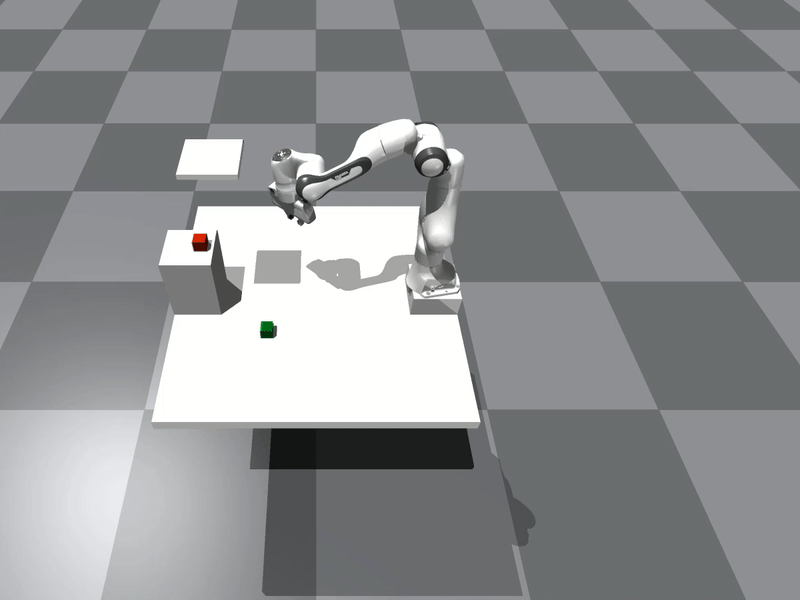

<p align="center">
    <h1 align="center">Multi-Modal MPPI and Active Inference for Reactive Task and Motion Planning</h1>
    <h3 align="center"><a href="https://arxiv.org/abs/2312.02328">Paper</a> | <a href="https://sites.google.com/view/m3p2i-aip">Website</a> | <a href="https://www.youtube.com/watch?v=y2CTgv6hxVI&t=2s">Video</a> </h3>
</p>

Repository for reactive task and motion planning making use of active inference for symbolic planning, and a new multi-modal MPPI for motion planning. Rollouts are evaluated in IsaacGym, a parallelizable physics simulator.

<p align="center">
     &nbsp; 
</p>

## Status
Under development

## Installation
First, clone the repo on your computer. 
```
git clone https://github.com/tud-airlab/m3p2i-aip.git
```
This project requires the source code of IsaacGym. Download it from https://developer.nvidia.com/isaac-gym and we suggest installing it in a conda environment. Move into `m3p2i-aip` and activate the environment

````bash
cd <m3p2i_aip_folder>
conda acivate <env_name>
````
You also need the following packages:
- dash
- pandas
- npy_append_array
- matplotlib

You need an NVIDIA graphics card to use the GPU pipeline (default). This package has been tested in Ubuntu 2020.

## Test and run

Then you are ready to test a script:

````bash
cd <m3p2i_aip_folder>/scripts/examples
python3 example_key.py
````
With this script, you can drive the robot around with ASDW keys. 

If you want to test the MPPI, you will need two instances of Isaac Gym, one for the rollouts, and one for the "real system". Run the commands below in two terminals from the */scripts* folder: 
````
python3 reactive_tamp.py --robot $(robot_type) --task $(task_type)
````

````
python3 sim.py --robot $(robot_type) --task $(task_type)
````

You can specify `robot_type` as `point`, `boxer`, `heijn` or `panda`, and specify `task_type` as `simple`, `patrolling`, `reactive`, `pick` or `reactive_pick`. You can also try experiments with the arguments passed to the MPPI, such as sampling around prior controllers or null actions, as well as time horizon and number of samples, which can be modified in the */params* folder. 

## Troubleshooting
If you have an Nvidia card and after running the simulation you get a black screen, you might need to force the use of the GPU card through ``export VK_ICD_FILENAMES=/usr/share/vulkan/icd.d/nvidia_icd.json``. Run this command from the same folder as the script to be launched
